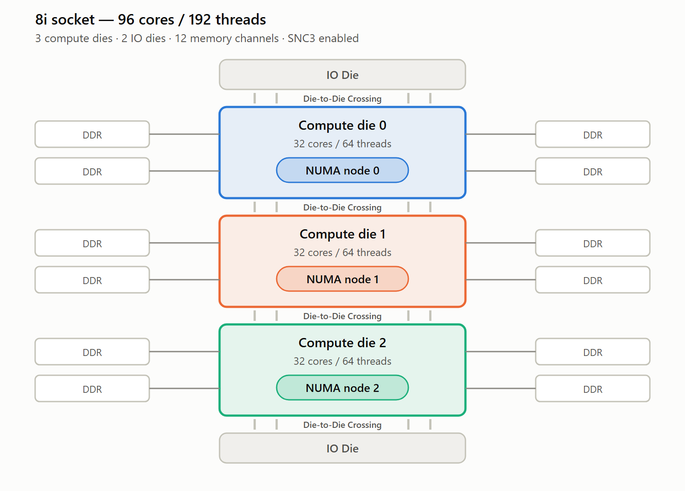

# GNR (8i) on AWS

Notes on AWS EC2 8i instances — the Granite Rapids (Intel Xeon 6) generation — focused on
NUMA/SNC3 topology, plus key features, specifications versus prior generations, and the
resulting strengths.

See also: [GNR (C4) on GCP](gcp_gnr.md) — the same processor generation on Google Cloud — and
[Cross-Cloud Comparison](cross_cloud.md) for the AWS-versus-GCP node-width differences.

---

## Contents

- [NUMA Topology](#numa-topology)
- [Intel Architecture Instance Types on AWS](#intel-architecture-instance-types-on-aws)
- [AWS GNR Instances & Key Features](#aws-gnr-instances--key-features)
- [Instance Pricing](#instance-pricing)
- [Specifications: 6i vs 7i vs 8i (per socket)](#specifications-6i-vs-7i-vs-8i-per-socket)
- [Differentiation: Strengths](#differentiation-strengths)

---

## NUMA Topology

8i instances expose the Intel Xeon 6 SNC3 feature for best performance. Each socket is presented
to the OS as **3 NUMA nodes**, each with 32 cores and memory closer to those cores, giving the best
memory latencies for NUMA-aware applications.

### SNC3 architecture

Each GNR socket contains **3 compute dies** and **12 memory channels**. With **SNC3** enabled,
each compute die is presented as its own NUMA node:

- 32 cores / 64 threads per NUMA node
- Memory from 4 channels attached to each node
- Memory in the other clusters of the same socket is remote-cluster memory

### Per-socket comparison

| | Cores/socket | vCPUs/socket | NUMA nodes/socket |
| --- | --- | --- | --- |
| 6i | 32 | 64 | 1 |
| 7i | 48 | 96 | 1 |
| 8i | 96 | 192 | **3** |

### Sockets and NUMA nodes by VM size

| VM size | R6i sockets | R6i NUMA | R7i sockets | R7i NUMA | R8i sockets | R8i NUMA |
| --- | --- | --- | --- | --- | --- | --- |
| 4xl | 1 | 1 | 1 | 1 | 1 | 1 |
| 8xl | 1 | 1 | 1 | 1 | 1 | 1 |
| 12xl | 1 | 1 | 1 | 1 | 1 | 1 |
| 16xl | 1 | 1 | 1 | 1 | 1 | 1 |
| 24xl | 2 | 2 | 1 | 1 | 1 | 2 |
| 32xl | 2 | 2 | NA | NA | 1 | 2 |
| 48xl | NA | NA | 2 | 2 | 1 | 3 |
| 96xl | NA | NA | NA | NA | 2 | 6 |

> **Note** — R8i reaches 48xl within a **single socket**, where R7i needs two.

### 8i NUMA node and compute die layout by VM size

| VM size | vCPUs | Sockets | NUMA nodes | vCPUs/node | Cores/node | Compute die coverage |
| --- | --- | --- | --- | --- | --- | --- |
| 4xl | 16 | 1 | 1 | 16 | 8 | Partial compute die |
| 8xl | 32 | 1 | 1 | 32 | 16 | Partial compute die |
| 12xl | 48 | 1 | 1 | 48 | 24 | Partial compute die |
| 16xl | 64 | 1 | 1 | 64 | 32 | 1 full compute die |
| 24xl | 96 | 1 | **2** | 48 | 24 | 2 partial compute dies |
| 32xl | 128 | 1 | **2** | 64 | 32 | 2 full compute dies |
| 48xl | 192 | 1 | **3** | 64 | 32 | Single socket (3 compute dies) |
| 96xl | 384 | 2 | **6** | 64 | 32 | Full system (6 compute dies) |

> **Note** — the vCPUs/node and Cores/node columns are derived (vCPUs ÷ NUMA nodes, halved for
> Hyper-Threading); the source deck states sockets, NUMA nodes, and die coverage directly.

### Practical guidance

- **Sizes up to 16xl are a single NUMA node**, so NUMA placement and pinning are moot there.
- **24xl and 32xl span 2 nodes**, 48xl spans 3 nodes within one socket, and 96xl spans 6 nodes
  across 2 sockets. 48xl is the largest size with no cross-socket traffic.
- **Node width is not always 32 cores.** 24xl is built from 2 *partial* dies (24 cores each), so a
  node there exposes fewer cores than a full die. Don't assume a uniform 32 cores/node across sizes.
- Verify the topology on a running instance with `lscpu` or `numactl -H` — these are general Linux
  tools, not something the source deck specifies.

---

## Intel Architecture Instance Types on AWS

AWS offers Intel-based instances across every major family. Instance families are grouped by
workload profile:

| Family | Purpose |
| --- | --- |
| **General Purpose** (M, T) | Balance of compute, memory, and networking for diverse workloads. |
| **Compute Optimized** (C) | Compute-bound applications that benefit from high performance processors. |
| **Memory Optimized** (R, X, U, z1d) | Fast performance for workloads processing large in-memory data sets. |
| **Storage Optimized** (I, D, H) | High sequential read/write access to very large data sets on local storage. |
| **Accelerated Compute** (P, G, F, DL1) | Hardware accelerators / co-processors for specialized functions. |
| **HPC Optimized** (HPC6id) | Large, complex simulations and deep learning workloads. |

### Processor generation mapping

| AWS naming | Intel generation | Codename |
| --- | --- | --- |
| 8i (M8i, C8i, R8i, X8i, plus `-flex` and `d` variants) | Intel Xeon 6 | **Granite Rapids** |
| I7i, I7ie | 5th Gen Intel Xeon Scalable | Emerald Rapids |
| 7i (M7i, C7i, R7i, R7iz, U7i, U7in, U7inh, plus `-flex` variants) | 4th Gen Intel Xeon Scalable | Sapphire Rapids |
| 6i (M6i, C6i, R6i, X2idn, X2iedn, I4i) | 3rd Gen Intel Xeon Scalable | Ice Lake |
| 5-series, later parts (M5n, R5n, X2iezn) | 2nd Gen Intel Xeon Scalable | Cascade Lake |
| 5-series, early parts (M5, C5, R5, z1d, I3en) | Intel Xeon Scalable | Skylake |
| M4, C4, R4, X1, D2 | Intel Xeon v3 / v4 | Haswell / Broadwell, varies by size |

> **Note** — the AWS generation digit does not track the Intel generation. **I7i is Emerald Rapids,
> one Intel generation newer than the Sapphire Rapids M7i/C7i/R7i**, because the storage-optimized
> line numbers independently of the compute lines. No AWS `7i` compute family is Emerald Rapids at
> all: those went Sapphire Rapids (7i) straight to Granite Rapids (8i). Confirm the processor for a
> specific instance type in the AWS specification tables rather than inferring it from the name.

> **Note** — the 8i row is **Intel Xeon 6**, not "6th Gen Intel Xeon Scalable"; Intel dropped the
> "Nth Gen … Scalable" scheme for this generation, and AWS follows the Xeon 6 branding.

### AWS instance suffix decoder

| Suffix | Meaning |
| --- | --- |
| `d` | Instance store volumes |
| `n` | Network and EBS optimized |
| `e` | Extra storage or memory |
| `z` | High performance |
| `-flex` | Flex variant (see [pricing](#instance-pricing)) |

Reference: <https://aws.amazon.com/ec2/instance-types/> and
<https://docs.aws.amazon.com/AWSEC2/latest/UserGuide/instance-types.html>

The per-instance-type processor is listed in the AWS specification tables, which are the source for
the mapping above: [general purpose](https://docs.aws.amazon.com/ec2/latest/instancetypes/gp.html),
[compute optimized](https://docs.aws.amazon.com/ec2/latest/instancetypes/co.html),
[memory optimized](https://docs.aws.amazon.com/ec2/latest/instancetypes/mo.html),
[storage optimized](https://docs.aws.amazon.com/ec2/latest/instancetypes/so.html).

---

## AWS GNR Instances & Key Features

- Powered by **custom Xeon 6 processors** — 96 cores / 192 threads per socket
- **Sustained all-core turbo frequency of 3.9 GHz**
- **2.5x higher memory throughput** (DDR5-7200)
- **4.6x larger L3 cache**
- AMX improvements
- Network and EBS bandwidth scaled by **25%**
- Two new instance sizes: **32xlarge** (versus SPR) and **96xlarge**

### vCPU-to-memory ratio by family

| Instance families | Memory per vCPU (GB) |
| --- | --- |
| C8i, C8i-flex, C8id | 2 |
| M8i, M8i-flex, M8id | 4 |
| R8i, R8i-flex, R8id | 8 |
| X8i | 16 |

### Instance sizes

| Size | vCPUs |
| --- | --- |
| large | 2 |
| xlarge | 4 |
| 2xlarge | 8 |
| 4xlarge | 16 |
| 8xlarge | 32 |
| 12xlarge | 48 |
| 16xlarge | 64 |
| 24xlarge | 96 |
| 32xlarge | 128 |
| 48xlarge | 192 |
| 96xlarge | 384 |
| metal-48xl | 192 |
| metal-96xl | 384 |

---

## Instance Pricing

Comparing C7i, C8i, and C8i-flex:

- **C8i** carries roughly a **5% price increase** over the previous generation.
- **C8i-flex** is priced **on par with the previous generation**.

---

## Specifications: 6i vs 7i vs 8i (per socket)

| | 6i | 7i | 8i |
| --- | --- | --- | --- |
| Micro architecture | Ice Lake | Sapphire Rapids | **Granite Rapids** |
| Cores per socket | 32 | 48 | **96** |
| vCPUs per socket | 64 | 96 | **192** |
| Max frequency | 3.5 GHz | 3.8 GHz | **3.9 GHz** |
| All-core frequency | 3.5 GHz | 3.2 GHz | **3.9 GHz** |
| Memory | DDR4-3200 | DDR5-4800 | **DDR5-7200** |
| L2 cache per core | 1.3 MB | 2 MB | 2 MB |
| L3 cache | 54 MB | 210 MB | **480 MB** |
| Memory channels | 8 | 8 | **12** |
| Sub-NUMA Cluster (SNC) | No | No | **Yes (SNC3)** |
| TDP | 300 W | 385 W | 600 W |
| Accelerators | — | AMX, QAT, IAA/DSA, DLB | AMX, QAT, IAA/DSA, DLB |

---

## Differentiation: Strengths

- **Consistent single-core and all-core turbo frequency** (3.9 GHz)
- **Largest system offering** — 384 vCPUs / 6 TB memory
- **Largest single-socket offering** — 192 vCPUs / 3 TB memory
- **Consistent performance metrics/events (PMU) across all VM sizes**
- Accelerators targeting specific customer scenarios:
  - **AMX** — AI workloads
  - **QAT** — crypto, compression/decompression
  - **IAA/DSA** — analytics, compression/decompression (zram, zswap)
