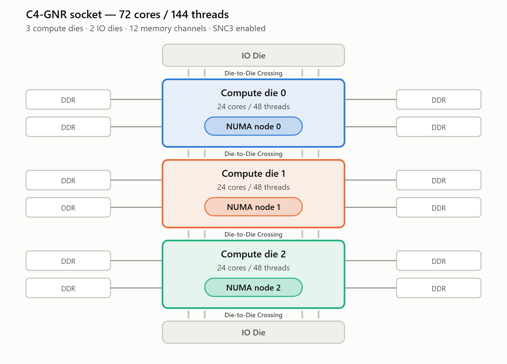

# GNR (C4) on GCP

Notes on Google Cloud's Intel-based machine series, focused on **C4 with Intel Xeon 6
(Granite Rapids)**: NUMA/compute-die topology, the SPR→GNR single-socket delta, and the
shape/feature comparison against C4-EMR.

See also: [GNR (8i) on AWS](aws_gnr.md) — the same processor generation on AWS — and
[Cross-Cloud Comparison](cross_cloud.md) for the AWS-versus-GCP node-width differences.

---

## Contents

- [NUMA Topology](#numa-topology)
- [Intel Architecture Instance Types on Google Cloud](#intel-architecture-instance-types-on-google-cloud)
- [Machine Series Comparison: C4-EMR vs C4-GNR](#machine-series-comparison-c4-emr-vs-c4-gnr)
- [What C4 on Xeon 6 Adds](#what-c4-on-xeon-6-adds)
- [SPR to GNR in a Single Socket](#spr-to-gnr-in-a-single-socket)
- [Identifying a GNR-backed C4](#identifying-a-gnr-backed-c4)

---

## NUMA Topology

Each 72-core socket is presented as **3 NUMA nodes** — each with 24 cores and local memory. This
provides optimal memory latencies for NUMA-aware applications.

> **Note** — the tables in this section use `c4-standard` shape names, but the NUMA and socket
> layout depends only on vCPU count. It applies equally to `c4-highmem` and `c4-highcpu` shapes of
> the same size.

### SNC3 architecture

A GNR socket contains **3 compute dies** and **12 memory channels**, plus IO dies. With **SNC3**,
each compute die is presented as its own NUMA node:

A full 2-socket system is 6 compute dies and 6 NUMA nodes.

### Per-socket comparison

| | Cores per socket | vCPUs per socket | NUMA nodes per socket |
| --- | --- | --- | --- |
| C3 | 44 | 88 | 2 |
| C4-GNR | 72 | 144 | **3** |

### Sockets by VM size

| vCPUs | SPR shape (c3) | c3 sockets | GNR shape (c4-GNR) | c4 sockets |
| --- | --- | --- | --- | --- |
| 4 | `c3-standard-4` | 1 | `c4-standard-4` | 1 |
| 8 | `c3-standard-8` | 1 | `c4-standard-8` | 1 |
| 16 | NA | NA | `c4-standard-16` | 1 |
| 22 | `c3-standard-22` | 1 | NA | NA |
| 24 | NA | NA | `c4-standard-24` | 1 |
| 32 | NA | NA | `c4-standard-32` | 1 |
| 44 | `c3-standard-44` | 1 | NA | NA |
| 48 | NA | NA | `c4-standard-48` | 1 |
| 88 | `c3-standard-88` | 1 | NA | NA |
| 96 | NA | NA | `c4-standard-96` | 1 |
| 144 | NA | NA | `c4-standard-144` | 1 |
| 176 | `c3-standard-176` | 2 | NA | NA |
| 192 | `c3-standard-192-metal` | 2 | `c4-standard-192` | 2 |
| 288 | NA | NA | `c4-standard-288` | 2 |

### NUMA nodes by VM size

| vCPUs | SPR shape (c3) | c3 NUMA | GNR shape (c4-GNR) | c4 NUMA |
| --- | --- | --- | --- | --- |
| 4 | `c3-standard-4` | 1 | `c4-standard-4` | 1 |
| 8 | `c3-standard-8` | 1 | `c4-standard-8` | 1 |
| 16 | NA | NA | `c4-standard-16` | 1 |
| 22 | `c3-standard-22` | 1 | NA | NA |
| 24 | NA | NA | `c4-standard-24` | 1 |
| 32 | NA | NA | `c4-standard-32` | 1 |
| 44 | `c3-standard-44` | 1 | NA | NA |
| 48 | NA | NA | `c4-standard-48` | 1 |
| 88 | `c3-standard-88` | 2 | NA | NA |
| 96 | NA | NA | `c4-standard-96` | 2 |
| 144 | NA | NA | `c4-standard-144` | **3** |
| 176 | `c3-standard-176` | 4 | NA | NA |
| 192 | `c3-standard-192-metal` | 4 | `c4-standard-192` | 4 |
| 288 | NA | NA | `c4-standard-288` | **6** |

### C4-GNR NUMA node and compute die layout by shape

| Shape | vCPUs | Sockets | NUMA nodes | vCPUs/node | Cores/node | Compute die coverage |
| --- | --- | --- | --- | --- | --- | --- |
| `c4-standard-4` | 4 | 1 | 1 | 4 | 2 | Partial compute die |
| `c4-standard-8` | 8 | 1 | 1 | 8 | 4 | Partial compute die |
| `c4-standard-16` | 16 | 1 | 1 | 16 | 8 | Partial compute die |
| `c4-standard-24` | 24 | 1 | 1 | 24 | 12 | Partial compute die |
| `c4-standard-32` | 32 | 1 | 1 | 32 | 16 | Partial compute die |
| `c4-standard-48` | 48 | 1 | 1 | 48 | 24 | 1 full compute die |
| `c4-standard-96` | 96 | 1 | **2** | 48 | 24 | 2 full compute dies |
| `c4-standard-144` | 144 | 1 | **3** | 48 | 24 | Single socket (3 compute dies) |
| `c4-standard-192` | 192 | 2 | **4** | 48 | 24 | 2 compute dies per socket |
| `c4-standard-288` | 288 | 2 | **6** | 48 | 24 | Full system (6 compute dies) |

> **Note** — the vCPUs/node and Cores/node columns are derived (vCPUs ÷ NUMA nodes, halved for
> Hyper-Threading). A compute die is 24 cores, so `c4-standard-48` is 48 vCPUs = 24 cores = one
> full compute die.

### Practical guidance

- **Shapes up to `c4-standard-48` are a single NUMA node**, so NUMA placement and pinning are moot
  there. `c4-standard-48` is exactly one full compute die.
- **Node width is a uniform 48 vCPUs / 24 cores** at every multi-node shape — simpler than C3,
  where a node is 44 vCPUs.
- **`c4-standard-192` is split evenly across sockets.** It reports 2 sockets and 4 NUMA nodes,
  laid out as 2 nodes per socket, so it uses 2 of the 3 compute dies on each socket. This
  matches the 2 sockets × 2 nodes layout of `c3-standard-192-metal`.
- **`c4-standard-144` is the largest shape with no cross-socket traffic** (3 nodes, single socket).
- Verify the topology on a running instance with `lscpu` or `numactl -H`.

---

## Intel Architecture Instance Types on Google Cloud

| Category | Purpose |
| --- | --- |
| **General Compute** (N1, N2, N4) | Balanced compute, memory, and network resources for general-purpose workloads: analytics, databases, enterprise applications. |
| **Compute-Optimized** (C2, C3, C4, H3, C3.Metal) | Enhanced execution resources for compute-bound workloads: data science, ML/AI inference, gaming, HPC. |
| **Memory-Optimized / Large Memory / Storage-Optimized** (M1, M2, M3, M4, X4, Z3) | Enhanced memory or storage for memory-bound / IOPS-bound workloads: in-memory databases and analytics, SQL, HANA. |
| **VMware** (VE1, VE2) | Google Cloud VMware Engine (GCVE), optimized for VMware workloads. |

### Processor generation mapping

| Intel generation | Google Cloud machine series |
| --- | --- |
| 5th / 6th Gen Intel Xeon Scalable | N4, C4, X4, M4, C3 w/ Confidential Compute (Intel TDX), C3.Metal |
| 4th Gen Intel Xeon Scalable | C3, H3, VE2, Z3 |
| 3rd Gen Intel Xeon Scalable | N2 w/ Ice Lake |
| 2nd Gen Intel Xeon Scalable | N2, C2, M2, VE1 |
| Intel Xeon Scalable processors | N1, M1 |
| Intel Xeon v4 and earlier | N1, M1 (earlier variants) |

---

## Machine Series Comparison: C4-EMR vs C4-GNR

| | **C4 (EMR)** | **C4 (GNR)** |
| --- | --- | --- |
| **Predefined shapes** | Up to 192 vCPU, 1,536 GB RAM | **Up to 288 vCPU, 2,232 GB RAM** |
| **Custom shapes** | N/A | N/A |
| **Implementation** | Shapes aligned to processor architecture, enabling maximum isolation and consistency | Shapes aligned to processor architecture, enabling maximum isolation and consistency |
| **Frequency** | Up to 4.0 GHz (single-core max turbo) | **Up to 4.2 GHz (single-core max turbo)** |
| **Hyperdisk Balanced** | Up to 320K IOPS, up to 10,000 MiB/s | Up to 320K IOPS, up to **12,500 MiB/s** |
| **Hyperdisk Extreme** | Up to 500K IOPS, up to 10,000 MiB/s | Up to 500K IOPS, up to 10,000 MiB/s |
| **Hyperdisk Throughput** | Up to 40K IOPS, up to 10,000 MiB/s | Up to 40K IOPS, up to 10,000 MiB/s |
| **Local SSD** | N/A | **Standard, Highmem** |
| **Networking (standard)** | Up to 100 Gbps | Up to 100 Gbps |
| **Networking (Tier_1)** | Up to 200 Gbps | Up to 200 Gbps |
| **Maintenance** | Advanced maintenance | Standard maintenance |
| **Additional features** | Sole Tenancy, compact + spread placement | Sole Tenancy (coming soon), spread placement, Confidential Compute |
| **Billing / consumption** | Standard CUDs, Flex CUDs, Spot, Reservations | Standard CUDs, Flex CUDs, Spot, Reservations |

> **Note** — the Hyperdisk rows are the per-shape ceilings from
> [Hyperdisk performance limits](https://docs.cloud.google.com/compute/docs/disks/hyperdisk-perf-limits).
> Google states them **per machine type, not per CPU platform**, and in MiB/s: the EMR column is
> `c4-*-192` (the largest Emerald Rapids shape) and the GNR column is `c4-*-288`. Which shapes land on
> which processor is documented in
> [C4 machine series](https://docs.cloud.google.com/compute/docs/general-purpose-machines#c4_series) —
> `-lssd` and `-metal` shapes plus the 144- and 288-vCPU shapes are Granite Rapids (and
> `c4-standard-192` can also be Granite Rapids). Starting an instance with
> `--min-cpu-platform="Intel Granite Rapids"` guarantees that the C4 instance is Granite Rapids.
> Smaller shapes are capped well below these numbers, so check the limits table for the specific
> shape rather than reading these as available at any size.

The high performance of C4 is a good fit for:

- Databases and caches
- Network appliances
- High-traffic web and application servers, analytics
- Real-time CPU-based inference, with Intel AMX

---

## What C4 on Xeon 6 Adds

The C4 machine series expands to the latest Intel Xeon 6 processor (Granite Rapids), delivering new
capabilities, more shape options, and greater flexibility — targeting databases, analytics, gaming,
real-time platforms, and inference.

- **C4 with Titanium Local SSD** — new VM shapes featuring Titanium Local SSDs for I/O-intensive
  applications.
- **C4 Bare Metal** — new bare metal shapes for customers needing maximum control and flexibility.
- **Larger C4 shapes** — higher frequencies, larger cache sizes, and up to **2.2 TB of memory**,
  reaching **up to 4.2 GHz**. Enables databases, data analytics, and other memory-bound or
  license-constrained workloads to scale effectively.

---

## SPR to GNR in a Single Socket

| | SPR | GNR |
| --- | --- | --- |
| Frequency (all-core turbo) | 3.0 GHz | **3.9 GHz** |
| vCPUs | 88 | **144** |
| Memory channels | 8 | **12** |
| Memory speed | 4800 MT/s | **6400 MT/s** |
| SNC | SNC2 or SNC4 | **SNC3** |
| Hyper-Threading | On | On |
| SSD | N/A | **Yes** |

Example SPR instance: `c3-standard-88`  ·  Example GNR instance: `c4-standard-144`

---

## Identifying a GNR-backed C4

- All `-lssd` shapes are GNR, but GNR shapes without local SSD also exist (e.g.
  `c4-standard-192`), so the reliable way to get GNR is to start the instance with
  `--min-cpu-platform="Intel Granite Rapids"`.
- GNR-backed C4 instance types display **"Intel Granite Rapids"** on the GCP instance page. The
  `C4` name alone **does not guarantee GNR** unless the page shows "Intel Granite Rapids".
