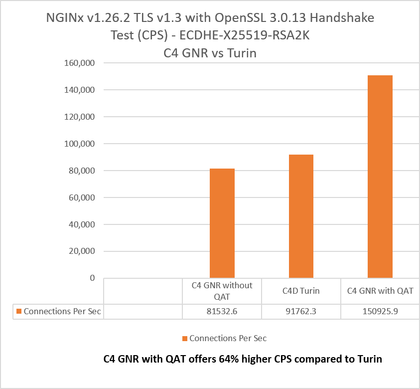

# NGINX with Intel® QuickAssist Technology (Intel® QAT) Optimization Guide
## Table of Contents

- [Overview](#overview)
- [QAT Hardware Requirement](#qat-hardware-requirement)
- [QAT Software Requirement and Prerequisites](#qat-software-requirement-and-prerequisites)
  - [Enabling the Required QAT Services](#enabling-the-required-qat-services)
- [async-mode-nginx Configuration](#async-mode-nginx-configuration)
- [Building and configuring async-mode-nginx](#building-and-configuring-async-mode-nginx)
  - [Generating the Server Certificate](#generating-the-server-certificate)
  - [Validating the Configuration](#validating-the-configuration)
- [Supporting Files](#supporting-files)
- [Benchmarking](#benchmarking)
  - [Core Allocation and `worker_processes`](#core-allocation-and-worker_processes)
- [Results](#results)
- [Details](#details)
- [References](#references)

## Overview

Compression and cryptography take up a significant portion of resources in the data center.   Hardware acceleration like Intel® QuickAssist Technology (Intel® QAT) can be used to offload the compression and encryption portions of a workload.  Offloading these operations will free up CPU cores to do other work and will improve compression and cryptography performance.  NGINX is the world's most popular webserver.  It is free and open source software, distributed under the terms of a simplified 2-clause BSD-like license.  The "Async Mode for NGINX" adds asynchronous capabilities to NGINX using the OpenSSL Async Infrastructure.


## QAT Hardware Requirement

At least one Intel® QAT engine is required and the individual engine might need to be updated in the BIOS.  The following steps should be performed to be ready to use the QAT device(s).

1.  Check for QAT device availability.  This can be verified by running the following command:

```
count=0
for id in 4940 4941 4942 4943 4944 4945 4946 4947; do
        count=$((count + $(lspci -d 8086:$id 2>/dev/null | wc -l)))
done
echo "$count supported devices found."
```

The command reports how many supported devices were found.  At least one is required.  On the system used for this benchmarking, the output was:

```
8 supported devices found.
```

2. Verify that the QAT firmware is already loaded by using the following command:

```
ls /lib/firmware/{qat_4xxx,qat_402xx,qat_420xx}.bin* 2>/dev/null
ls /lib/firmware/{qat_4xxx,qat_402xx,qat_420xx}_mmp.bin* 2>/dev/null
```

The output of the above command should include 2 firmware files.  Note that this can vary depending on the exact QAT device on your hardware.

```
 /lib/firmware/qat_402xx.bin
 /lib/firmware/qat_402xx_mmp.bin
```

If the firmware is not already available, it can be downloaded from the Linux kernel repository:
https://git.kernel.org/pub/scm/linux/kernel/git/firmware/linux-firmware.git/tree/intel/qat

```
cd ~
wget https://git.kernel.org/pub/scm/linux/kernel/git/firmware/linux-firmware.git/plain/intel/qat/qat_4xxx.bin
wget https://git.kernel.org/pub/scm/linux/kernel/git/firmware/linux-firmware.git/plain/intel/qat/qat_4xxx_mmp.bin
wget https://git.kernel.org/pub/scm/linux/kernel/git/firmware/linux-firmware.git/plain/intel/qat/qat_402xx.bin
wget https://git.kernel.org/pub/scm/linux/kernel/git/firmware/linux-firmware.git/plain/intel/qat/qat_402xx_mmp.bin
wget https://git.kernel.org/pub/scm/linux/kernel/git/firmware/linux-firmware.git/plain/intel/qat/qat_420xx.bin
wget https://git.kernel.org/pub/scm/linux/kernel/git/firmware/linux-firmware.git/plain/intel/qat/qat_420xx_mmp.bin
sudo cp qat_4xxx*.bin qat_402xx*.bin qat_420xx*.bin /lib/firmware
rm qat_4xxx*.bin qat_402xx*.bin qat_420xx*.bin
```

After firmware is updated, the initramfs must be updated.  This differs based on the Linux distribution.

3.  Verify that the kernel drivers are loaded using the following command.

```
lsmod | grep qat
```

The output should be similar to the following:

```
qat_4xxx               16384  0
intel_qat             172032  1 qat_4xxx
```

If the kernel modules are not found, they can be installed using:

```
sudo modprobe intel_qat
sudo modprobe qat_4xxx
```

If the kernel modules could not be installed, it might be needed to either install them through a kernel configuration or to install them with the distribution's package manager.

## QAT Software Requirement and Prerequisites

The QAT driver is available either "in-tree" as part of a release kernel or can be built outside of the release.  This document assumes the use of the in-tree driver that is already available with kernel after version 5.19.  The distribution used for this benchmarking was Ubuntu 24.04 with the in-tree driver.

QATLib provides user space libraries that allow QAT device access and expose APIs for use by higher level applications.  The QATLib driver can be installed using your distribution's package manager.  For Ubuntu 24.04:

```
sudo -E apt install -y libqat4 libqat-dev qatlib-service qatlib-examples libusdm-dev
```

QATzip is a user-space library built on top of the Intel® QuickAssist Technology (QAT) user-space library. It provides extended compression and decompression capabilities by offloading these operations to Intel® QAT Accelerators.

```
sudo -E apt install -y qatzip libqatzip3
```

Depending on the use case, the user can configure the number of QAT engines to use with the workload.  In "Managed Mode", the [QATLib](https://intel.github.io/quickassist/qatlib/index.html) library can be used to restrict the workload to a specific number of engines.

Please note that "intel_iommu=on" will be required as a kernel parameter.

### Enabling the Required QAT Services

Each QAT device is configured by a `/etc/4xxx_dev*.conf` file, and the `ServicesEnabled` setting in the `[GENERAL]` section controls which acceleration services that device exposes.  This setting must include the services your workload actually uses:

| ServicesEnabled | Services available |
| --- | --- |
| `dc` | Compression/decompression only |
| `sym` | Symmetric crypto only |
| `asym` | Asymmetric crypto (public key) only |
| `sym;dc` | Symmetric crypto and compression |
| `asym;dc` | Asymmetric crypto and compression |

This matters because the two optimizations in this guide use different services.  The qatzip module (`ngx_http_qatzip_filter_module`) needs `dc`, while QATEngine handling TLS handshakes (`ngx_ssl_engine_qat_module`) needs the crypto services.  A device left at the compression-only default will not accelerate TLS, and the Connections Per Second (CPS) results below cannot be reproduced on it.

Check the current setting:

```
grep -H ServicesEnabled /etc/4xxx_dev*.conf
```

To use both compression and TLS acceleration, set the following in each device's `[GENERAL]` section:

```
ServicesEnabled = asym;dc
```

Then restart the service and confirm the devices come back up:

```
sudo systemctl restart qat.service
sudo systemctl status qat.service
```

Note that the available `ServicesEnabled` combinations vary by QAT generation, and not all services can be enabled on a single device simultaneously.  See the [QATLib Users Guide](https://intel.github.io/quickassist/qatlib/index.html) for the combinations supported by your hardware.

## async-mode-nginx Configuration

This optimization was tested with the following software versions:

async_mode_nginx v1.0.0
nginx 1.26.2
OpenSSL 3.0.13
QATEngine 2.0.0-1~noble1

QATEngine is the OpenSSL engine that `nginx_with_qat.conf` selects via `use_engine qatengine`.  On Ubuntu 24.04 it can be installed with:

```
sudo -E apt install -y qatengine
```


## Building and configuring async-mode-nginx

[async-mode-nginx](https://github.com/intel/asynch_mode_nginx) can be built with:

```
./configure \
  --prefix=$NGINX_INSTALL_DIR \
  --with-http_ssl_module \
  --add-dynamic-module=modules/nginx_qatzip_module \
  --add-dynamic-module=modules/nginx_qat_module/ \
  --with-cc-opt="-DNGX_SECURE_MEM -I$OPENSSL_LIB/include -I$ICP_ROOT/quickassist/include -I$ICP_ROOT/quickassist/include/dc -I$QZ_ROOT/include -Wno-error=deprecated-declarations" \
  --with-ld-opt="-Wl,-rpath=$OPENSSL_LIB/lib64 -L$OPENSSL_LIB/lib64 -L$QZ_ROOT/src -lqatzip -lz"

make
make install
```

### Generating the Server Certificate

Both configuration files in `supporting_files/` expect a certificate and key at the paths below.  These are not created by the build, so generate them before starting the server.  The results in this guide used a 2048-bit RSA key (RSA2K):

```
sudo mkdir -p /usr/local/nginx_qat_module/certs
sudo openssl req -x509 -newkey rsa:2048 -nodes -days 365 \
  -keyout /usr/local/nginx_qat_module/certs/server.key \
  -out /usr/local/nginx_qat_module/certs/server.crt \
  -subj "/CN=localhost"
sudo chmod 600 /usr/local/nginx_qat_module/certs/server.key
```

This produces a self-signed certificate, which is appropriate for benchmarking but not for production use.

### Validating the Configuration

Before running a benchmark, confirm that the configuration parses and that any dynamic modules it loads are present:

```
$NGINX_INSTALL_DIR/sbin/nginx -t -c /path/to/nginx_with_qat.conf
```

A successful check reports:

```
nginx: configuration file /path/to/nginx_with_qat.conf test is successful
```

This step catches missing module paths, unreadable certificates, and syntax errors before they show up as a failed test run.

## Supporting Files

| File | Purpose |
| --- | --- |
| [`supporting_files/nginx_with_qat.conf`](supporting_files/nginx_with_qat.conf) | async-mode-nginx configuration with the QAT modules loaded and the QAT engine enabled. |
| [`supporting_files/nginx_without_qat.conf`](supporting_files/nginx_without_qat.conf) | Baseline configuration with the QAT modules commented out.  Note that this still uses the `asynch` listen parameter, so it must be run with the async-mode-nginx binary rather than stock nginx. |
| [`supporting_files/connection_test.sh`](supporting_files/connection_test.sh) | Drives the Connections Per Second (CPS) handshake test using `openssl s_time`. |
| `images/nginx_qat_comparison_intel_amd.png` | CPS results chart. |

## Benchmarking

CPS is measured with `supporting_files/connection_test.sh`, which spawns 200 concurrent `openssl s_time` clients against the server for 10 seconds each and sums the per-client connection rates:

```
./supporting_files/connection_test.sh <server_ip>
```

To print the commands without running them:

```
./supporting_files/connection_test.sh <server_ip> --emulation
```

The client count, duration, port, and cipher are set in the USER INPUT block at the top of the script.  Note that the script's default cipher (`AES128-SHA`) and the `ssl_protocols TLSv1.2` setting in both configuration files do not match the TLS 1.3 / ECDHE-X25519-RSA2K configuration shown in the results chart below; adjust both to reproduce those specific numbers.

### Core Allocation and `worker_processes`

Both configuration files set `worker_processes 48`, which is deliberately fewer than the cores available on the test system rather than all of them.

This reflects the scenario the guide is intended to demonstrate.  In a real deployment, a web tier rarely has an entire high-core-count server to itself — it shares the machine with application, caching, or database workloads.  The question that matters is therefore not "what peak CPS can this server reach with every core dedicated to NGINX," but "how much TLS throughput can be delivered from a modest slice of the machine, leaving the rest for other work."

Offloading handshake cryptography to the QAT devices is what makes that slice go further.  Because the asymmetric crypto moves off the cores and onto dedicated accelerators, the same 48 workers sustain substantially higher connection rates than they do without QAT — so the cores that remain free are genuinely available to other tenants rather than being consumed by TLS overhead.

## Results



Intel® QAT is only exposed on bare-metal cloud instances, so this comparison is run there rather than on virtualized shapes.  The two C4 GNR bars are the same bare-metal Intel Xeon 6985P system (`c4-highmem-288-metal`) described under [Details](#details), both running `worker_processes 48`, with the QAT modules and QAT engine as the only variable between them — the "without QAT" bar corresponds to `nginx_without_qat.conf` and the "with QAT" bar to `nginx_with_qat.conf`.  The C4D Turin instance is likewise bare metal, so the cross-platform comparison holds the provisioning model constant as well.

## Details

NGINX on GNR (c4-highmem-288-metal), bare metal: Intel(R) Xeon(R) 6985P, 144 cores, 500W TDP, HT On, Turbo On, NUMA 6, Total Memory 2232GB, microcode 0x1000380, 4 QAT engines, Ubuntu 24.04 LTS, 6.14.0-gcp. Test by Intel as of Oct 6, 2025, async_mode_nginx version 1.0.0, nginx 1.26.2, OpenSSL 3.0.13, QATEngine 2.0.0

NGINX on Turin (c4d-highmem-384-metal), bare metal: AMD(R) EPYC(R) 9B45, 192 cores, HT On, Turbo On, NUMA 2, Total Memory 3072GB, microcode 0xb002150, Ubuntu 24.04 LTS, 6.14.0-gcp. Test by Intel as of Oct 6, 2025, async_mode_nginx version 1.0.0, nginx 1.26.2, OpenSSL 3.0.13

Results may vary.

## References

asynch_mode_nginx: https://github.com/intel/asynch_mode_nginx

QATLib Users Guide: https://intel.github.io/quickassist/qatlib/index.html

QATzip: https://github.com/intel/QATzip

QATEngine: https://github.com/intel/QAT_Engine
